# Button Styles

A simple button styles project with different styles like normal, dashed border, gradient border, glowing border, glowing button, icon button, diagonal icon button and more.

## Sceenshots

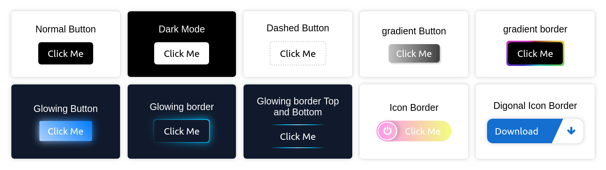
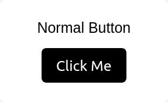
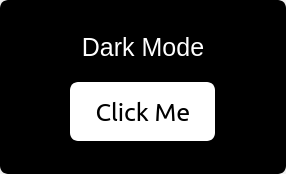
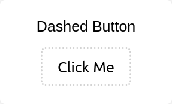
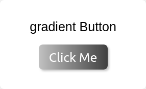  
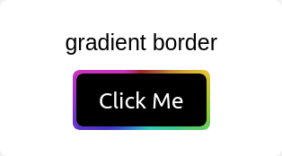
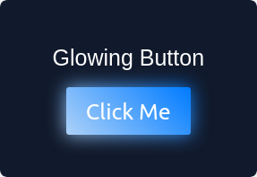
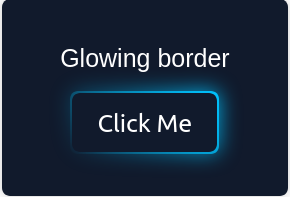
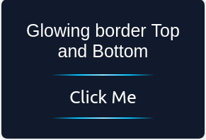
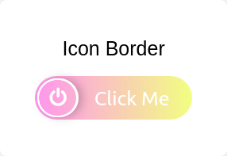
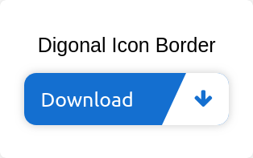

## Setup

Go to index.html file and open the html file in any browser.

## Authors

👤 **Nesrya Abdulkadir**

- Github: [@NesryaAbdulkadir](https://github.com/NesryaAbdulkadir)
